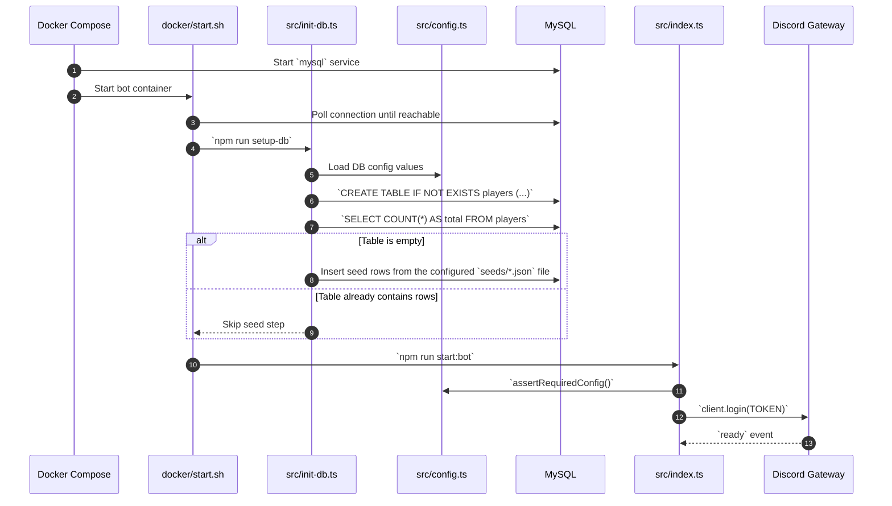
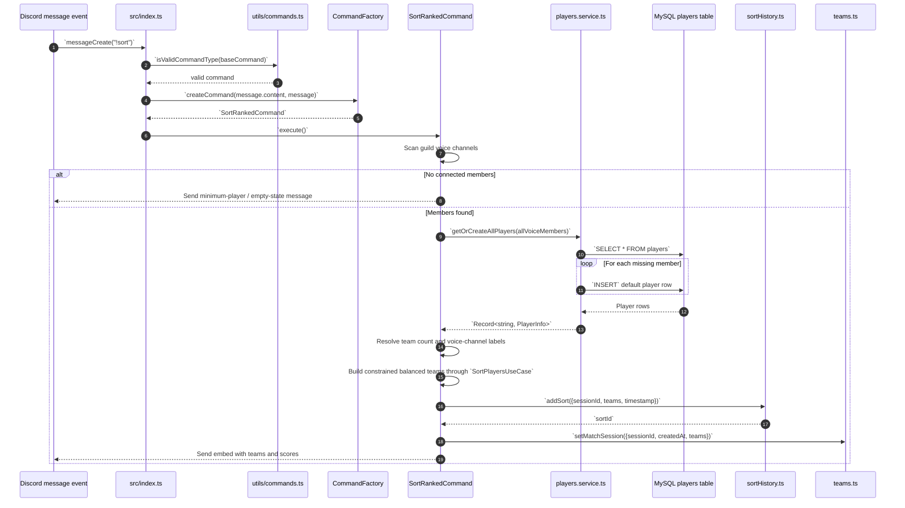
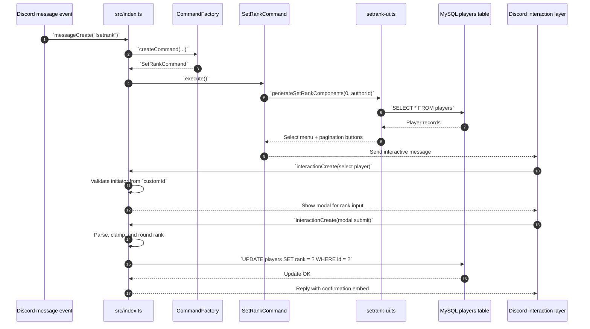
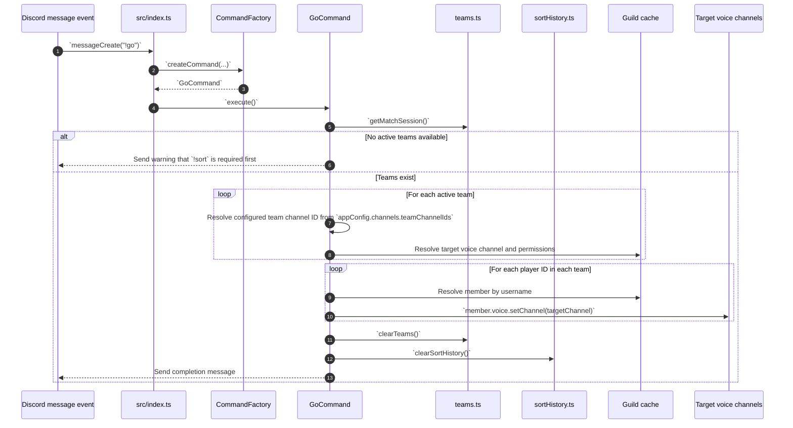
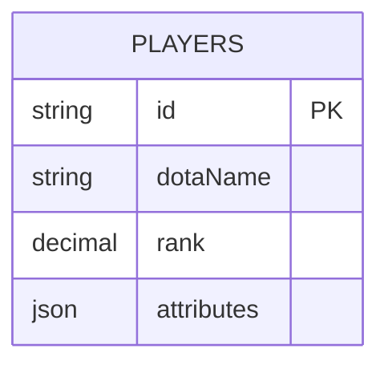
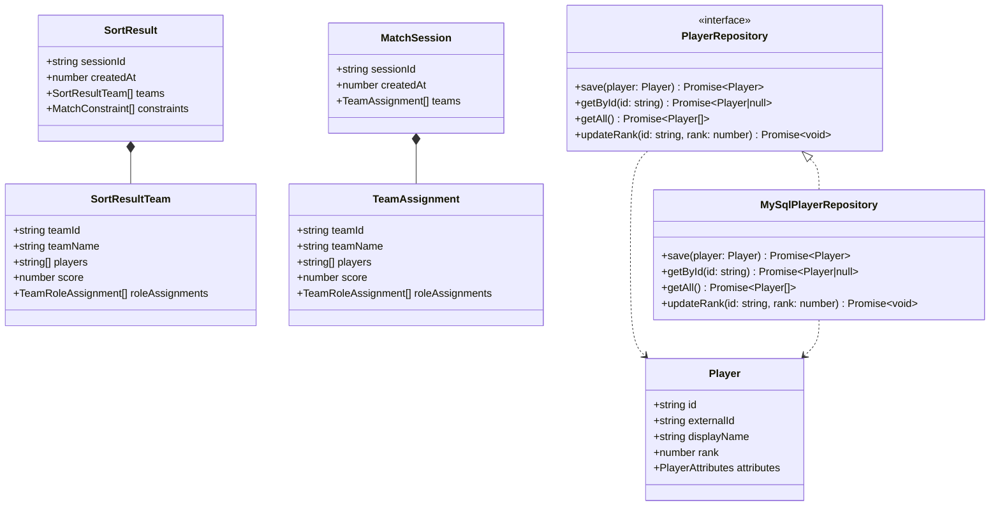

# ARCHITECTURE

_Last verified: 2026-04-27_

_Technology context: Built with Node.js runtime and TypeScript._

_Detailed technical architecture reference for the current repository, including deployment topology, runtime structure, and Mermaid diagrams for the most important execution paths._

## Available Diagrams

- [Overall system architecture](#31-overall-system-architecture-diagram)
- [Internal component architecture](#41-component-diagram)
- [Startup and bootstrap sequence](#51-startup-and-bootstrap-sequence)
- [Ranked sort sequence (`!sort`)](#52-ranked-sort-sequence-sort)
- [Rank update interaction sequence (`!setrank` + modal flow)](#53-rank-update-interaction-sequence-setrank--modal-flow)
- [Voice deployment sequence (`!go`)](#54-voice-deployment-sequence-go)
- [Persistence ER diagram](#61-persistence-er-diagram)
- [Core class diagram](#62-core-class-diagram)

## 1. Architectural Classification

## 1.1 Primary architectural style

The project is best described as a **layered modular monolith with event-driven command processing**.

It is **not** a microservices architecture and it is **not** a classical MVC web application.

### Why this classification fits

- **Single deployable application unit**: all business logic runs inside one Node.js bot process.
- **Event-driven ingress**: execution begins from Discord events rather than HTTP routes.
- **Command-oriented application layer**: the main use cases are implemented as command classes under `src/factory/commands/**`.
- **Layered separation of responsibilities**:
  - ingress and orchestration in `src/index.ts`
  - routing in `CommandFactory`
  - business use cases in command classes
  - persistence and synchronization in `src/services/players.service.ts`
  - infrastructure in `src/config.ts`, `src/db.ts`, `src/init-db.ts`, Docker files
  - transient state in `src/state/**` and `src/store/**`
- **Two-service deployment topology**: the bot application and MySQL database are separate runtime services, but only the bot contains application-domain behavior.

## 1.2 Secondary architectural characteristics

The implementation also exhibits these patterns:

- **Factory pattern** for command instantiation (`CommandFactory`)
- **Interactive UI workflow pattern** for select menus, buttons, and modal submissions
- **Repository/service-like DB access** via `players.service.ts`
- **Ephemeral in-memory state management** for active teams and recent sort history
- **Bootstrap/initializer pattern** via `src/init-db.ts` and `docker/start.sh`

---

## 2. Architectural Layers and Responsibilities

| Layer | Main Files | Responsibility |
|---|---|---|
| Event ingress | `src/index.ts` | Receives Discord events and starts application flows |
| Input validation | `src/utils/commands.ts`, `src/types/commands.ts` | Validates supported command tokens |
| Routing and orchestration | `src/factory/commands/main/CommandFactory.ts` | Maps validated command text to concrete handlers |
| Application use cases | `src/factory/commands/game/**`, `src/factory/commands/players/**`, `src/factory/commands/main/HelpCommand.ts`, `src/application/use-cases/**` | Implements sorting, replay, swapping, listing, movement, rank management, and attribute updates |
| UI composition | `src/components/setrank-ui.ts`, `src/components/setattribute-ui.ts`, `src/components/move-ui.ts` | Builds Discord select menus, buttons, and modal-related UI structures |
| Service / data access | `src/services/players.service.ts` | Reads player records, auto-creates missing rows, and exposes DB-backed lookup operations |
| Runtime state | `src/state/teams.ts`, `src/store/sortHistory.ts` | Holds transient active-team and sort-history state during process lifetime |
| Seed and static data | `seeds/*.json`, `src/localization/**`, `textSource.json` | Supplies initial player seed data and localized user-facing text; `textSource.json` is legacy content |
| Infrastructure | `src/config.ts`, `src/db.ts`, `src/init-db.ts`, `docker/start.sh`, `Dockerfile`, `docker-compose.yml` | Configuration loading, DB pool creation, schema bootstrapping, and containerized startup |

### Important constraint

The runtime state in `teams.ts` and `sortHistory.ts` is **process-local** and **non-persistent**. It is preserved only while the bot process remains alive.

---

## 3. High-Level System Architecture

This section describes the deployment and communication topology.

### Key runtime actors

- **Discord Platform**: emits message and interaction events and receives bot responses
- **Bot Service**: a Node.js/TypeScript runtime containing all orchestration and business logic
- **MySQL Service**: the persistent storage backend for the `players` table
- **Docker Volume**: stores MySQL data across container restarts

## 3.1 Overall system architecture diagram

```mermaid
flowchart TB
    Discord["Discord Platform<br/>Gateway events + interactions + voice state"] --> Entry["`src/index.ts`<br/>Discord client and event entry points"]

    subgraph BotService["Bot Service (Node.js / TypeScript)"]
        Entry --> Validate["`src/utils/commands.ts`<br/>Command validation"]
        Validate --> Factory["`CommandFactory`<br/>Command dispatch"]
        Factory --> Commands["Command handlers<br/>sort, replay, swap, go, move, setrank, list, help"]
        Commands <--> UI["UI components<br/>`setrank-ui.ts`, `move-ui.ts`"]
        Commands --> Services["Service layer<br/>`players.service.ts`"]
        Commands <--> RuntimeState["Runtime state<br/>`teams.ts`, `sortHistory.ts`"]
        Services --> DBPool["Infrastructure<br/>`config.ts` + `db.ts`"]
        Entry --> DBPool
    end

    StartScript["`docker/start.sh`"] --> InitDB["`src/init-db.ts`<br/>schema bootstrap + seed"]
    InitDB --> MySQL[("MySQL 8.4<br/>`players` table")]
    DBPool --> MySQL
    MySQL --- Volume[("Docker volume<br/>`db_data`")]
```

### Interpretation

- `src/index.ts` is the **composition root** and **runtime ingress point**.
- `CommandFactory` centralizes use-case selection from raw command text.
- Commands depend on both **persistent storage** (`players.service.ts` + MySQL) and **ephemeral state** (`teams.ts`, `sortHistory.ts`).
- `docker/start.sh` serializes the startup workflow: DB readiness check -> schema/seed initialization -> bot launch.

---

## 4. Internal Component Architecture

The following diagram focuses on code-level module relationships inside the bot service.

## 4.1 Component diagram

```mermaid
flowchart LR
    subgraph Ingress["Ingress / Event Layer"]
        M["`messageCreate`"]
        I["`interactionCreate`<br/>prefix-only interaction router"]
    end

    subgraph Orchestration["Orchestration Layer"]
        IDX["`src/index.ts`"]
        VAL["`utils/commands.ts`"]
        F["`CommandFactory`"]
        BASE["`Command` base class"]
    end

    subgraph UseCases["Application Use Cases"]
        SORT["Sort / Replay / Swap"]
        VOICE["Go / Lobby / Move"]
        PLAYER["List / SetRank / SetAttribute / Help"]
    end

    subgraph Support["Support Modules"]
        UI["UI builders<br/>`setrank-ui.ts`, `setattribute-ui.ts`, `move-ui.ts`"]
        HELPER["Voice member helper<br/>`retieveChatMembers.ts`"]
        SERVICE["`players.service.ts`"]
        TEAMS["`teams.ts`"]
        HISTORY["`sortHistory.ts`"]
        SEED["`players.ts`"]
        TEXT["Localization<br/>`src/localization/**`"]
    end

    subgraph Infra["Infrastructure"]
        CFG["`config.ts`"]
        DB["`db.ts`"]
        MYSQL[("MySQL `players` table")]
    end

    M --> IDX
    I --> IDX
    IDX --> VAL --> F --> BASE
    BASE --> SORT
    BASE --> VOICE
    BASE --> PLAYER

    SORT --> HELPER
    SORT --> SERVICE
    SORT --> TEAMS
    SORT --> HISTORY
    SORT --> TEXT

    VOICE --> UI
    VOICE --> TEAMS
    VOICE --> HISTORY

    PLAYER --> UI
    PLAYER --> SERVICE

    SERVICE --> DB --> MYSQL
    CFG --> DB
    SEED -.used during bootstrap.-> MYSQL
```

### Interpretation

- The architecture is **use-case centric**, not model-centric.
- `src/index.ts` contains the ingress orchestration but intentionally delegates business behavior.
- The command classes serve as the main application boundary for domain operations.
- `players.service.ts` is the only shared DB-access abstraction currently used across multiple commands.
- UI builders are isolated from business logic, which simplifies interactive flow generation.
- Chat-input slash commands are wired through `interactionCreate`, but the current runtime rejects them in favor of prefix commands.

---

## 5. Critical Sequence Diagrams

The following diagrams explain the most important runtime processes end to end.

## 5.1 Startup and bootstrap sequence



### Architectural significance

This sequence establishes that application availability depends on:
1. MySQL readiness
2. schema presence
3. token validation
4. Discord gateway login

The startup path is **serialized and deterministic**, which reduces race conditions between the bot and the DB service.

## 5.2 Ranked sort sequence (`!sort`)



### Architectural significance

This is the main business workflow of the application.

It combines:
- event intake
- command routing
- persistence synchronization
- balancing logic
- runtime state publication
- end-user presentation through a Discord embed

## 5.3 Rank update interaction sequence (`!setrank` + modal flow)



### Architectural significance

This sequence shows a **multi-step conversational UI transaction**:
- command invocation starts the workflow
- components encode session context into `customId`
- the interaction handler performs authorization and persistence update
- the result is immediately visible through a confirmation response

## 5.4 Voice deployment sequence (`!go`)



### Architectural significance

This is the terminal phase of the team-sorting lifecycle. It consumes transient team state and converts it into actual Discord voice-channel placement.

---

## 6. Persistence and Runtime State Model

## 6.1 Persistence ER diagram

The current persistent relational model is intentionally minimal and centered on a single table.



### Notes on the data model

- `id` is the primary identifier used by the application to index player records.
- `dotaName` is the display-oriented name used in embeds and list output.
- `rank` is the balancing metric used by `SortRankedCommand`.
- `attributes` stores role metadata such as `support`, `tank`, and `carry` as numeric proficiency values from `0` to `100`.
- The current balancing algorithm still optimizes by score, but it also seeds teams with role constraints from `src/config/gameRules.ts` when team sizes require them.

## 6.2 Core class diagram

The following class diagram captures the main domain, DTO, and persistence abstractions.



### Class model notes

- `Player` is the canonical runtime/domain player model used by balancing and update flows.
- `SortResult` and `SortResultTeam` represent sort output persisted in in-memory history.
- `MatchSession` and `TeamAssignment` represent active runtime team state used by deployment commands.
- `PlayerRepository` defines the persistence contract; `MySqlPlayerRepository` is the current infrastructure implementation.

## 6.3 Non-persistent runtime state

Not all operational data is stored in MySQL.

| Runtime store | File | Purpose | Persistence |
|---|---|---|---|
| Active match session | `src/state/teams.ts` | Holds the currently active `MatchSession` with dynamic `teams[]` data | In-memory only |
| Sort history | `src/store/sortHistory.ts` | Keeps up to 35 prior sort results for replay and swap | In-memory only |
| Seed player dataset | `seeds/example.players.json` | Initial bootstrap source for first-time DB seeding | Source-controlled static file |

This separation means the application combines **persistent player metadata** with **ephemeral session orchestration state**.

---

## 7. Architectural Strengths and Constraints

## 7.1 Strengths

- **Low operational complexity**: a single bot service and one DB service are easy to run and reason about.
- **Direct mapping from command to use case**: each command has a dedicated implementation unit.
- **Clear event boundary**: all runtime behavior originates from Discord events handled in one place.
- **Fast interactive workflows**: in-memory state makes replay, swap, and go flows responsive.
- **Docker-first reproducibility**: startup behavior is consistent across environments that support Docker Compose.

## 7.2 Constraints and trade-offs

- **No durable match/session state**: active teams and history are lost when the process restarts.
- **Tight coupling to Discord runtime semantics**: there is no abstraction for alternative front ends.
- **Direct SQL usage**: data access is simple and explicit, but not abstracted into a broader repository/domain layer.
- **Single-process scaling model**: horizontal scaling would require redesign of in-memory state handling.
- **Shared mutable runtime state**: `teams.ts` and `sortHistory.ts` are global within the process and therefore assume one logical active runtime context.

---

## 8. Extension Guidance for Future Development

Any future architectural change should account for the current boundaries:

1. **New commands** should continue to enter through `CommandFactory` and extend the `Command` base class.
2. **New interactive Discord flows** should keep UI generation in `src/components/**` and stateful interaction handling in `src/index.ts` or a dedicated interaction module.
3. **Additional persistence requirements** should be added through `players.service.ts` or a similarly scoped service layer rather than ad hoc queries spread across commands.
4. **Persistent match history** would require moving `sortHistory.ts` into MySQL or another shared storage mechanism.
5. **Multi-instance deployment** would require replacing in-memory team state with externally shared state.

---

## 9. Summary

The current repository implements a **layered, command-oriented, event-driven modular monolith**. Its architecture is optimized for Discord-based operations: inbound messages and interactions are routed through a central ingress point, mapped to use-case handlers, combined with DB-backed player metadata, and completed through message embeds, modal workflows, or voice-channel movement.

From a deployment perspective, the system is a **two-service Docker Compose stack** consisting of:
- a Node.js bot service containing all application logic
- a MySQL service storing player metadata

This structure is technically simple, operationally practical, and well-suited to the current feature set.
